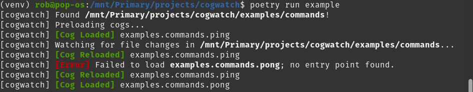

<h1 align="center">Cog Watch</h1>
    
<div align="center">
  <strong><i>Automatic hot-reloading for your discord.py command files.</i></strong>
  <br />
  <br />
  
  <a href="https://pypi.org/project/cogwatch">  </a>
  
  <a href="https://python.org">  </a>
</div>
<br />

`cogwatch` is a utility that you can plug into your `discord.py` bot _(or
various supported bot libraries)_ that will watch your command files directory
_(cogs)_ and automatically reload them as you modify or move them around in
real-time.

No more reloading your commands manually every time you edit an embed just to
make sure it looks perfect!

 <br />

## Features

- Automatically reloads commands in real-time as you edit them _(no !reload
  <command_name> needed)_.
- Optionally handles the loading of all your commands on start-up _(removes
  boilerplate)_.

## Supported Libraries

`cogwatch` _should_ work with any library that forked from `discord.py`.
However, these libraries have been explicitly tested to work:

- [discord.py](https://discordpy.readthedocs.io/en/stable/)
- [nextcord](https://docs.nextcord.dev/en/stable/)
- [discord4py](https://docs.discord4py.dev/en/developer/)
- [disnake](https://disnake.readthedocs.io/en/latest/)
- [pycord](https://docs.pycord.dev/en/stable/)

## Getting Started

You can install the library with `pip install cogwatch`.

Import the `watch` decorator and apply it to your `on_ready` method and let the
magic take effect.

See the [examples](/examples) directory for more details.

```python
import asyncio
from discord.ext import commands
from cogwatch import watch


class ExampleBot(commands.Bot):
    def __init__(self):
        super().__init__(command_prefix='!')

    @watch(path='commands', preload=True) # This is all you need to add.
    async def on_ready(self):
        print('Bot ready.')

    async def on_message(self, message):
        if message.author.bot:
            return

        await self.process_commands(message)


async def main():
    client = ExampleBot()
    await client.start('YOUR_TOKEN_GOES_HERE')

if __name__ == '__main__':
    asyncio.run(main())
```

__NOTE__: If you're following the example command files in the
[examples](/examples) directory, make sure you only use `async/await` on your
setup function if the library you're using supports it. For example,
`discord.py` uses async setup functions, but many other libraries do not.
`cogwatch` supports both under-the-hood.

## Configuration

These options can be passed to the decorator _(or the class if manually
initializing)_:

| Option | Type | Description | Default |
| --- | --- | --- | --- |
| `path` | `str` | Path of the directory where your command files exist; cogwatch will watch recursively within this directory. | `commands` |
| `preload` | `bool` | Whether to detect and load all cogs on start. | `False` |
| `colors` | `bool` | Whether to use colorized terminal outputs or not. | `True` |
| `default_logger` | `bool` | Whether to use the default logger _(to sys.stdout)_ or not. | `True` |
| `loop` | `asyncio.AbstractEventLoop` | Custom event loop. | `asyncio.get_event_loop()` |
| `debug` | `bool` | Whether to run the bot only when the Python __\_\_debug\_\___ flag is True. | `True` |

__NOTE:__ `cogwatch` will only run if the __\_\_debug\_\___ flag is set on
Python. You can read more about that
[here](https://docs.python.org/3/library/constants.html). In short, unless you
run Python with the _-O_ flag from your command line, __\_\_debug\_\___ will be
__True__. If you just want to bypass this feature, pass in `debug=False` and it
won't matter if the flag is enabled or not.

## Logging

By default, the utility has a logger configured so users can get output to the
console. You can disable this by passing in `default_logger=False`. If you want
to hook into the logger -- for example, to pipe your output to another terminal
or `tail` a file -- you can set up a custom logger like so:

```python
import logging
import sys

watch_log = logging.getLogger('cogwatch')
watch_log.setLevel(logging.INFO)
watch_handler = logging.StreamHandler(sys.stdout)
watch_handler.setFormatter(logging.Formatter('[%(name)s] %(message)s'))
watch_log.addHandler(watch_handler)
```

## Contributing

`cogwatch` is open to all contributions. If you have a feature request or found
a bug, please open an issue or submit a pull request. If your change is
significant, please open an issue first to discuss it.

Check out the [contributing guidelines](/CONTRIBUTING.md) for more details.

## Integration Tests

In order to test `cogwatch` against all of the supported libraries, there is a
small integration test suite built-in to this repository. These are not
automatically checked tests, but rather a way to manually set up the environment
for a specific library and run a bot with `cogwatch` to ensure it works as
expected.

The available scripts are:

- `poetry run discord4py`
- `poetry run discordpy`
- `poetry run disnake`
- `poetry run nextcord`
- `poetry run pycord`

## License

cogwatch is available under the __[MIT License](/LICENSE)__.
